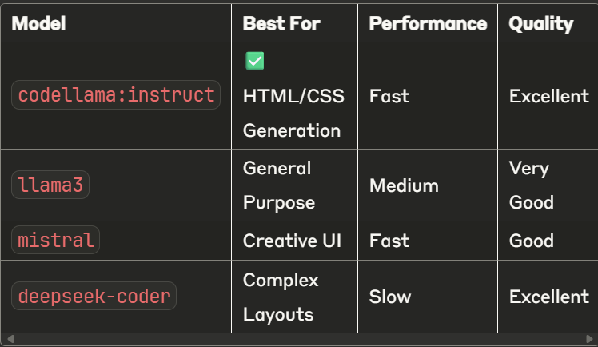

# 🎨 GUIDE - AI-Powered UI Generator

## Transform natural language descriptions into professional UI components using local AI models*

## 🌟 Overview

**GUIDE** is a sophisticated, local-first UI generation tool that leverages the power of open-source Large Language Models (LLMs) to convert natural language prompts into production-ready HTML, CSS, and Figma components. Built with privacy and performance in mind, GUIDE operates entirely offline using [Ollama](https://ollama.com) for AI inference.

### ✨ Key Features

- 🤖 **AI-Powered Generation**: Convert natural language to clean HTML/CSS using local LLMs
- 🔌 **Figma Integration**: Optional plugin for seamless Figma workflow integration
- 🎨 **Professional Output**: Generate responsive UI components
- ⚡ **Real-time Preview**: Instant live preview of generated UI components

---

### Project Structure

```
guide-ui-generator/
├── 📁 backend/
│   ├── app.py              # FastAPI main application
|
├── 📁 frontend/
│   ├── index.html          # Main interface
│   ├── code.js             # Images, icons, etc.
│   ├── style.css                # Stylesheets
│   └── index.js    
|   ├── manifest.json                     
└── README.md
```

---

## 🚀 Quick Start

### Prerequisites

Ensure you have the following installed:

- 🐍 **Python 3.10+** - [Download](https://python.org/downloads/)
- 🧠 **Ollama** - [Installation Guide](https://ollama.com)
- 🌐 **Modern Web Browser** (Chrome, Firefox, Safari, Edge)
- 🖼️ **Figma Desktop** (Optional, for plugin usage)

### 1. Clone Repository

```bash
git clone https://github.com/your-username/guide-ui-generator.git
cd guide-ui-generator
```

### 2. Setup Backend

```bash
cd backend

# Create virtual environment
python -m venv venv

# Activate virtual environment
venv\Scripts\activate # Windows

source venv/bin/activate # macOS/Linux

# Install dependencies
pip install -r requirements.txt

pip install fastapi uvicorn httpx pydantic

# Start FastAPI server
uvicorn app:app --reload --port 8000
```

### 3. Setup Ollama

In a separate terminal:

```bash
# Download and run recommended model
ollama pull codellama:instruct
ollama run codellama:instruct

# Alternative models
ollama pull llama3
ollama pull mistral
```

### 4. Launch Frontend

Open `index.html` in your web browser or serve it locally:

```bash
# Using Python's built-in server
python -m http.server 3000

# Or using Node.js
npx serve .
```

Navigate to `http://localhost:3000` and start generating!

---

## 🎯 Examples

### Basic Usage

```bash
# Example prompts that generate professional UI components:

"Create a modern login form with email and password fields"
→ Responsive login form with validation styling

"Design a red exit button with hover effects"
→ Styled button with smooth transitions

"Build a dashboard with navigation sidebar"
→ Complete dashboard layout with responsive design

"Create a contact form with name, email, and message"
→ Professional contact form with proper spacing
```

---

---

## 🧠 Recommended Models



### Model Configuration

Edit `MODEL_NAME` in `app.py` to switch models:

```python
MODEL_NAME = "codellama:instruct"  # Change this line
```

---

## 🔌 Figma Plugin Setup

### Installation

1. Open **Figma Desktop Application**
2. Navigate to `Plugins → Development → New Plugin`
3. Select `Import plugin from manifest`
4. Choose `plugin/manifest.json` from this repository
5. Click **Save** and run the plugin

### Usage

1. Start the backend server (`uvicorn app:app --reload --port 8000`)
2. Open the GUIDE plugin in Figma
3. Enter your UI prompt in the plugin interface
4. Click **Generate UI Components**
5. Components will be created directly in your Figma canvas


## 📄 License

This project is licensed under the **MIT License** - see the [LICENSE](LICENSE) file for details.

---

## 🙏 Acknowledgments

- [Ollama](https://ollama.com) for providing excellent local LLM infrastructure
- [FastAPI](https://fastapi.tiangolo.com) for the robust backend framework
- [Figma](https://figma.com) for the comprehensive plugin API
- The open-source community for continuous inspiration

---

